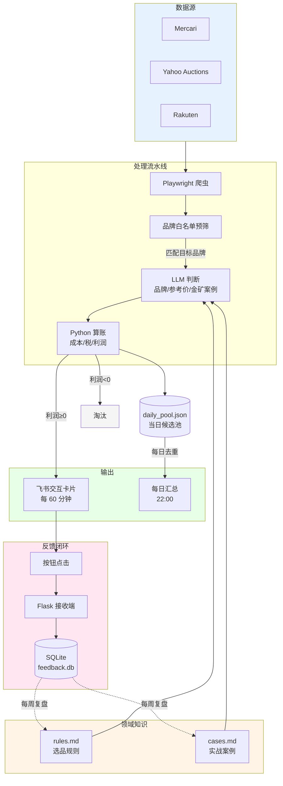

# kendama-selector

剑玉跨境选品助手

我做跨境剑玉采销,每天要在煤炉上翻几百条商品。
这个工具把我的选品判断写成规则,让 AI 替我做初筛,
通过**飞书自定义机器人**推送到手机,点击卡片按钮即可记录决策,
形成"AI 推荐 → 我反馈 → 规则迭代"的闭环。

> **项目状态**:个人使用中,持续优化。

---

## 为什么做这个

跨境采销的核心,是利用信息差和判断力。

剑玉这个品类小众但稳定。日本玩家圈子大,新品和老款流通活跃,
玩家对品相要求高——有轻微使用痕迹的剑玉,会以远低于全新的价格出售。
而国内的新玩家在找品质二手货,中间的差价里有利润。

但问题是:

- 每天有上百件新商品上架,大部分是基础款或残次品
- 真正值得拍的可能只有 3-5 件,有时甚至没有
- 我做了两年,知道哪些品牌的哪些款式值得买
- 但每天花在"翻商品"上的时间,占了 80%
- 为了第一时间拍下有价值的商品,还得频繁刷新

我想把浏览和初筛这件事让 AI 做。
但前提是:AI 必须懂我的判断标准——
什么样的产品有价值,什么样的痕迹会让价格腰斩,什么样的款式是坑。

这些知识在我脑子里,不在 AI 训练数据里。

所以这个项目的核心,不是用 AI——
**是把我的判断标准和选品经验,结构化成 AI 能读懂的规则**。

---

## 真实效果

### 卡片样式

<div align="center">
  
</div>

每条推送是一张飞书交互卡片,完整展示:
煤炉日元价 + 换算的价格 + 国内参考价 + 成本拆解
+ 利润 + 判定标签+ 一句话理由。
底部三个按钮记录我的反馈,
点击后跳转到反馈端。

信息密度足以让我立马就能做初步判断,
节省的就是过去花在翻页 + 心算上的时间。

### 系统命中速度

<div align="center">
  
</div>

左图为 23:50 系统推送的某商品,右图为约 2 小时后的煤炉页面状态,
商品已被买家拍下(标记 SOLD)。

剑玉中古市场的好货流通速度往往以小时计,
人工浏览很难全天盯盘。

不过单一案例不能证明系统普遍有效。
现在按钮反馈链路已经接通,我会持续记录推送和实际决策的对应关系,
后续给出更完整的统计。

---

## 系统架构



### 核心流程

1. **抓取**:Playwright 模拟浏览器访问三个平台,提取商品标题、价格、链接、图片。
2. **本地预筛**:基于品牌白名单做字符串匹配,过滤大部分无关商品,省 LLM token。
3. **LLM 判断**:按 15 条一批送给 DeepSeek,带上 `rules.md` 和 `cases.md` 作为上下文。
   LLM **只输出三件事**:品牌识别、是否命中金矿/踩坑案例、国内参考行情价。
   利润、成本、税不让 LLM 算——见下方"设计决策"。
4. **Python 算账**:用确定性公式算总成本(含运费、手续费、关税)和利润,
   利润 < 0 的直接淘汰,利润 ≥ 30 标"推荐",命中金矿 + 利润 ≥ 30 标"强推",
   0-30 之间标"盲盒"。
5. **推送**:每条候选生成一张飞书交互卡片,完整展示日元价 + 人民币换算价 +
   总成本拆解 + 利润,以及"买入 / 弃-太贵 / 弃-成色差"三个反馈按钮。
6. **反馈闭环**:点击按钮跳转到 `feedback_server.py` 的接收端,
   把决策(item_id、动作、原因、时间戳)写进 SQLite。
7. **每日汇总**:22:00 触发,把当天 `daily_pool.json` 去重后按利润降序拼成一张紫色卡片。
   汇总环节不走 LLM——LLM 负责"判断商品",Python 负责"排序套模板"。

### 为什么换掉 PushPlus

v1 用 PushPlus + 微信,卡片里的"按钮"其实是超链接,
微信内置浏览器不会自动打开外部域名,只能复制链接——反馈链路走不通。

换成飞书自定义机器人之后,卡片的 button 是原生组件,
点击直接发起 HTTPS 请求到反馈端点,无需用户做任何额外操作。
反馈端和主程序部署在同一台腾讯云轻量服务器上,
公网 IP + 防火墙开放端口直接对外提供服务,零额外成本。

### 运行方式

本地开发完成后部署到腾讯云轻量应用服务器,
通过 `nohup` 让 Python 进程后台运行,日志统一写入 `output.log`。
反馈接收端作为独立进程在同一台服务器上后台运行,
监听 5001 端口,通过开放防火墙规则对外暴露。

<div align="center">
  
</div>

上图为腾讯云服务器上的实时日志:
本轮抓取 302 条 → 本地预筛后剩 64 条 → 5 批送 DeepSeek 评估 → 筛出 24 条候选 → 推送成功。
全过程约 50 秒,DeepSeek API 5 次调用全部 200 OK。

### 设计决策

- **LLM 只判断,Python 算账**(v2 关键改动):
  早期把利润公式写进 prompt 让 LLM 算,但实际跑下来 LLM 会"凭印象估个数"——
  6000 日元的商品它能输出 ¥130 利润(实际 ¥24.9),9200 日元的商品它说 ¥114
  利润(实际亏损 ¥138)。大模型做多步骤算术本来就不可靠。
  v2 把利润、税、成本全部移到 Python 用确定性公式算,
  LLM 只负责给出"国内参考行情价"这个判断,数字从此不会再编。
- **用 Playwright 而不是 requests**:三个平台都有反爬,
  Playwright 模拟真实浏览器更稳定。
- **先本地预筛再送 LLM**:泛词搜索一次返回 300+ 商品(本轮 302 条),大部分品牌不在范围内。
  本地白名单匹配可剔除约 80%,实际只送 50-80 条给 LLM,显著降低调用成本。
- **主备 API**:国内访问 API 偶有抖动,主用 DeepSeek 官方,
  备用硅基流动作为兜底,不阻塞业务。
- **temperature=0**:LLM 默认有随机性,同一商品两次评估可能给出不同结论。
  设为 0 后输出稳定,便于后续做效果回归。
- **每日汇总不过 LLM**:汇总只是"去重 + 排序 + 套模板",
  这三件事 Python 一行就能搞定,过 LLM 反而不稳定还多花钱。
- **反馈接收端用 Flask + SQLite**:个人级写入量,没必要上 PostgreSQL。
  SQLite 单文件,备份和迁移成本几乎为零。

---

## 快速开始

### 环境要求

- Python 3.10+
- 操作系统:macOS / Linux / Windows

### 申请所需的服务

| 服务 | 用途 | 申请地址 |
|------|------|---------|
| DeepSeek | 主用 LLM | https://platform.deepseek.com |
| 硅基流动 | 备用 LLM | https://siliconflow.cn |
| 飞书 | 接收推送的群聊 + 自定义机器人 | https://www.feishu.cn |
| 腾讯云轻量服务器 | 24/7 部署 + 提供公网 IP | https://cloud.tencent.com/product/lighthouse |

### 安装

```bash
# 克隆仓库
git clone https://github.com/yourname/kendama-selector.git
cd kendama-selector

# 安装依赖
pip install -r requirements.txt

# 安装 Playwright 浏览器
playwright install chromium

# 配置环境变量
cp .env.example .env
# 编辑 .env,填入 DeepSeek API Key、飞书 webhook、反馈端 URL
```

### 创建飞书机器人

1. 在飞书里新建一个群聊(只有自己也行)
2. 群设置 → 群机器人 → 添加机器人 → 自定义机器人
3. 复制 webhook 地址,填入 `.env` 的 `FEISHU_WEBHOOK`

### 运行

```bash
# 启动主程序(扫描 + 推送)
python main.py

# 启动反馈接收端(可选,但点按钮要靠它)
python feedback_server.py
```

主程序启动后会立即执行一次扫描,然后进入定时模式:
- 每 60 分钟扫描一次
- 每天 22:00 输出全天汇总

### 反馈端暴露到公网

`feedback_server.py` 监听本地 5001 端口,飞书按钮点击需要它能从公网访问。

**首选方案:腾讯云直连(零成本)**

如果你和我一样,反馈端跟主程序部署在同一台腾讯云轻量服务器上,
那么这台机器本身就有公网 IP,不需要任何穿透工具。

1. 控制台 → 轻量应用服务器 → 实例详情 → **防火墙** → 添加规则:
   - 协议:TCP
   - 端口:5001
   - 来源:0.0.0.0/0

2. 如果服务器上开了 ufw,顺手放行:
   ```bash
   sudo ufw allow 5001/tcp
   ```

3. 拿到公网 IP,填进 `.env`:
   ```bash
   curl ifconfig.me
   ```
   ```
   FEEDBACK_URL=http://你的公网IP:5001/feedback
   ```

实测飞书自定义机器人接受 http 协议的 button URL,按钮可以正常点击跳转。
但 http 有几个不足:浏览器会标"不安全"、反馈数据明文传输理论上可被中间人篡改、
飞书未来可能收紧策略。**长期还是建议升级 HTTPS,看下面方案 A**。

**方案 A:Caddy + 自有域名(长期推荐)**

适合长期稳定运行。`.top` / `.xyz` 域名几块钱一年,A 记录指向公网 IP,
Caddy 自动申请 Let's Encrypt 证书并自动续期——比 Nginx 简单太多,一行配置搞定。
详见仓库内 `Caddyfile.example`。

**方案 B:cpolar 内网穿透**

只在反馈端跑在**内网机器**(家里电脑、学校实验室)时才需要这套。
云服务器本身就有公网 IP,不必绕这一圈。

### 适配其他品类

`rules.md` 和 `cases.md` 是这个项目的核心。
换品类时只需重写这两个文件:

- `rules.md`:你的判断规则(品牌、价格区间、款式偏好等)
- `cases.md`:你的实战案例(过去赚到的、踩过的坑)

代码层面不需要改动,LLM 会读这两个文件作为上下文。

### 部署到云服务器

我个人使用腾讯云轻量应用服务器(2 核 2G,Ubuntu)长期运行。

```bash
# 上传项目
scp -r kendama-selector/ user@your-server:/home/user/
ssh user@your-server
cd kendama-selector

# 安装依赖(只需一次)
pip install -r requirements.txt
playwright install chromium
playwright install-deps  # Linux 需要额外的系统依赖

# 后台运行主程序
nohup python main.py > output.log 2>&1 &

# 后台运行反馈接收端
nohup python feedback_server.py > feedback.log 2>&1 &

# 查看日志
tail -f output.log
tail -f feedback.log

# 查看反馈记录
sqlite3 feedback.db "SELECT * FROM feedback ORDER BY ts DESC LIMIT 20;"

# 停止
ps aux | grep "main.py\|feedback_server.py"
kill <PID>
```

每 60 分钟自动扫描一次,24 小时不间断。
即使本地电脑关机或断网,系统照常运行。

---

## 运行成本

| 项目 | 月成本(人民币) | 说明 |
|------|--------------|------|
| 腾讯云轻量服务器 | 约 30 元 | 2 核 2G,新用户首年低价。自带公网 IP |
| DeepSeek API | 约 5-15 元 | 每小时一次,日均约 24 次调用 |
| 飞书自定义机器人 | 0 元 | 个人和小团队免费 |
| 域名 / SSL(可选) | 约 1-5 元 | `.top` / `.xyz` 几块钱一年,Let's Encrypt 证书免费 |
| **合计** | **约 35-50 元/月** | |

如果用 GPT-4 / Claude 替代 DeepSeek,API 成本上升 5-10 倍,
对剑玉这种客单价不高的品类不划算。
选 DeepSeek 的核心理由——**便宜且够用,比最强重要**。

---

## 项目结构

```
kendama-selector/
├── main.py                主入口,定时扫描 + 推送
├── scraper.py             三平台爬虫
├── ai_filter.py           LLM 评估 + Python 算账 + 每日汇总
├── feedback_server.py     反馈接收端(Flask + SQLite)
├── rules.example.md       选品规则(脱敏示例)
├── cases.example.md       实战案例(脱敏示例)
├── config.yaml            关键词和品牌白名单
├── requirements.txt       依赖
├── .env.example           环境变量模板
├── Caddyfile.example      Caddy 反代配置(HTTPS 用)
└── .gitignore
```

---

## 数据闭环与持续优化

这个系统不是"一次性写完就用"——
**它的价值随着真实反馈的积累而增长**。

### v2 的关键升级:按钮反馈

v1 时代我每天:
1. 看 AI 推送的候选商品,**手动**在备忘录里标记是否同意它的判断
2. 实际拍下后,**手动**记录最终的国内成交价
3. 周末凭印象更新 `rules.md` 和 `cases.md`

这个流程的痛点是反馈摩擦太大——
看完一条推送如果还要切到备忘录写两行,我大概率会跳过这一步,
导致复盘时只能凭模糊记忆迭代规则。

v2 把反馈链路接通了:
- 卡片里直接点"买入 / 弃-太贵 / 弃-成色差"
- 后端自动写入 SQLite,带商品 url、动作、原因、时间戳
- 周末复盘时直接 SQL query,看哪些"AI 强推但被我标弃"、哪些"AI 盲盒但被我买入",
  这些就是规则需要迭代的边界案例

### 已落地的迭代

基于历史成交数据,我从 `rules.md` v0 迭代到当前版本,主要改进:

- 把"品牌优先级"细化到"品牌 + 漆面 + 款式"三层判断
- 增加重量门槛(剑玉玩家对重量敏感,过轻过重都会压价,服从正态分布)
- 把过往交易中的金矿案例和踩坑案例,整理进 `cases.md`
- **利润计算从 LLM 移到 Python**——LLM 算账靠拍脑袋,Python 用确定性公式才稳
- **汇率参数化**——`JPY_TO_CNY` 走环境变量,卡片里同时展示日元价和人民币换算价
- **卡片信息完整化**——展示完整的成本拆解(基础价、税、运费、总成本),
  方便人工二次核验 AI 的判断

### 下一步计划

- [x] 推送时附带反馈按钮 ~~(v2 已落地)~~
- [x] 利润计算移交 Python,LLM 只做判断 ~~(v2 已落地)~~

#### 基于反馈数据的偏好学习

`feedback.db` 里每条"买入 / 放弃"记录,本质就是偏好标签。
随着样本积累,把这份数据转化为推荐优化的路径从浅到深:

- **短期**:统计买入商品的高频特征(品牌、价位、关键词),
  自动写成 `personalized_signals.md`,注入 prompt
- **中期**:用 embedding 算"偏好向量",与商品向量算相似度,与 LLM 评分加权
- **长期**:在反馈数据上训练轻量分类器(LR / XGBoost)作为二次过滤

保留约 20% 探索性推送,避免只推熟悉款。

#### 关注卖家监控

优质卖家会持续上架同风格商品,盯人比盯关键词命中率更高。
在 `config.yaml` 加 `watched_sellers` 列表,爬虫逻辑复用现有关键词路径。

#### 价格变动监控

商品挂出来几天后降价是常见信号——卖家急着出,有捡漏空间。
每轮扫描记录商品历史价(SQLite),降价 ≥5% 或 ≥500 日元的标记 `[降价]` 单独推送。
工程难点是从三个平台的 URL 分别解析 item_id。

#### 其他

- [ ] 简单的复盘面板(每周自动统计准确率,推送一张周报卡片)
- [ ] 把 `daily_pool.json` 迁移到 SQLite,和 `feedback.db`、`listings` 统一管理
- [ ] 为核心纯函数(`calculate_profit` / `assign_tag`)加单元测试
- [ ] 反馈接收端加签名校验,避免公网 URL 被恶意写入

---

## FAQ

**Q: 为什么不直接 fine-tune 一个模型?**

A: Fine-tune 需要大量标注数据和算力,对个人项目不划算。
更重要的是,我的领域知识本来就在持续变化(每周都有新案例),
fine-tune 之后再修改的成本很高。
用 prompt + 规则书的方式,我可以随时改 `rules.md` 立即生效,
迭代速度远高于 fine-tune。

**Q: 为什么利润不让 LLM 算,要 Python 重新算一遍?**

A: 实测下来 LLM 算账不靠谱。
即使把公式写得再清楚,DeepSeek 也常常给出"看起来合理但其实是编的"数字——
6000 日元的商品 LLM 算出来 ¥130 利润,Python 用确定性公式算实际只有 ¥24.9;
9200 日元的 LLM 给 ¥114,实际亏损 ¥138。
大模型做多步骤算术本来就不可靠,这不是 prompt 能解决的问题。
正确的分工是:LLM 做判断(品牌、稀缺度、参考价),Python 做算术。
两者各做擅长的事,系统才稳。

**Q: 反馈数据怎么转化成更好的推荐?**

A: 见"下一步计划"里的"基于反馈数据的偏好学习"。
路径是从简到难:
先从 `feedback.db` 自动提取偏好信号,作为额外 context 注入 prompt(50 行能搞定);
等样本积累到几百条,再上 embedding 相似度匹配;
等样本上千,可以训练轻量分类器作为二次过滤。
但要警惕"回声室"——系统越推我买过的款,我就越看不到新机会,
需要保留一定比例的探索性推送。

**Q: 为什么不用 LangChain / Dify / Coze 这类框架?**

A: 我这个项目的核心逻辑很简单——
爬虫 → 预筛 → LLM 评估 → 推送 → 反馈。
用框架反而会引入不必要的复杂度。
直接写 Python + OpenAI SDK,代码总量不到 700 行,
调试和修改都很直接。

**Q: 为什么从 PushPlus 换成飞书?**

A: PushPlus 推到微信的"按钮"本质是超链接,
微信内置浏览器对外部域名做了拦截,点击只能复制链接,反馈链路走不通。
飞书自定义机器人的 button 是原生交互组件,点击直接发起 HTTP(S) 请求,
对个人项目是性价比最高的方案。

**Q: 为什么不用 GPT-4 而用 DeepSeek?**

A: 对剑玉这种客单价 300-800 元的品类,API 成本必须算清楚。
DeepSeek 的能力对"按规则筛选商品 + 给参考价"这个任务完全够用,
但价格只有 GPT-4 的 1/10 左右。
ToB 销售的本质是 ROI,选模型也一样——**够用且经济**比"最强"重要。

**Q: 适配其他品类需要改什么?**

A: 只需要重写 `rules.md` 和 `cases.md` 两个文件。
代码层面不需要任何改动。
我未来计划把这套框架应用到攀岩装备、滑雪装备等品类,
验证"领域知识结构化"这个方法论的可复用性。

**Q: 一轮扫描全流程要多久?**

A: 从启动扫描到推送到手机,约 1 分钟。
爬虫约 30-40 秒(三个平台串行),LLM 评估约 20-30 秒。
对"每小时一次"的使用频率来说,完全够用。

---

## 局限与诚实说明

- **不适合大规模商用**:本项目为个人采购场景设计,
  商业化需要更严谨的反爬、数据库和监控。
- **领域规则需要重写**:`rules.md` 是我的剑玉经验,
  换品类必须重写,代码框架可复用。
- **LLM 评估不是完全可靠**:即使有规则书,LLM 偶尔会产生幻觉或绕过规则,
  最终决策仍需人工把关——这正是反馈按钮存在的意义。
- **反馈端没做签名校验**:公网端口暴露后理论上可以被伪造请求灌脏数据,
  对个人使用影响不大,但商业化必须补上签名/鉴权。
- **代码不是工业级**:没有完整的单元测试和错误监控,
  作为个人工具够用,作为生产系统还不够。

---

## 技术栈

- **语言**:Python 3.10+
- **爬虫**:Playwright(无头浏览器)
- **LLM**:DeepSeek(主) / DeepSeek via SiliconFlow(备)
- **调度**:schedule
- **推送**:飞书自定义机器人(交互式卡片)
- **反馈接收**:Flask + SQLite
- **公网暴露**:腾讯云公网 IP 直连(主)/ Nginx + 域名 + Let's Encrypt(可选)
- **图片代理**:wsrv.nl(对老链接更稳)
- **部署**:腾讯云轻量应用服务器(Ubuntu, nohup 后台运行)

---

## 致谢

- [Playwright](https://playwright.dev/) —— 无头浏览器抓取
- [DeepSeek](https://www.deepseek.com/) —— LLM 推理
- [飞书开放平台](https://open.feishu.cn/) —— 交互式卡片消息
- [Flask](https://flask.palletsprojects.com/) —— 反馈接收端
- [腾讯云轻量应用服务器](https://cloud.tencent.com/product/lighthouse) —— 24/7 部署运行环境
- [wsrv.nl](https://wsrv.nl/) —— 图片代理服务

---

## License

[MIT](LICENSE)

仓库内的 `rules.example.md` 和 `cases.example.md` 是脱敏示例,
不包含完整的商业判断逻辑。
代码框架自由使用,使用导致的任何损失由使用者自行承担。

---

## 开发说明

我没有计算机或软件工程背景。
本项目的代码部分,主要在 AI 协作下完成。

我负责:领域规则(rules.md / cases.md)、需求设计、决策判断、工程整合。
代码实现:Claude(Opus 4.7)、Gemini Pro 和 DeepSeek 提供了大量帮助。

我相信这种"领域专家 + AI 协作"的工作方式会变得越来越普遍。