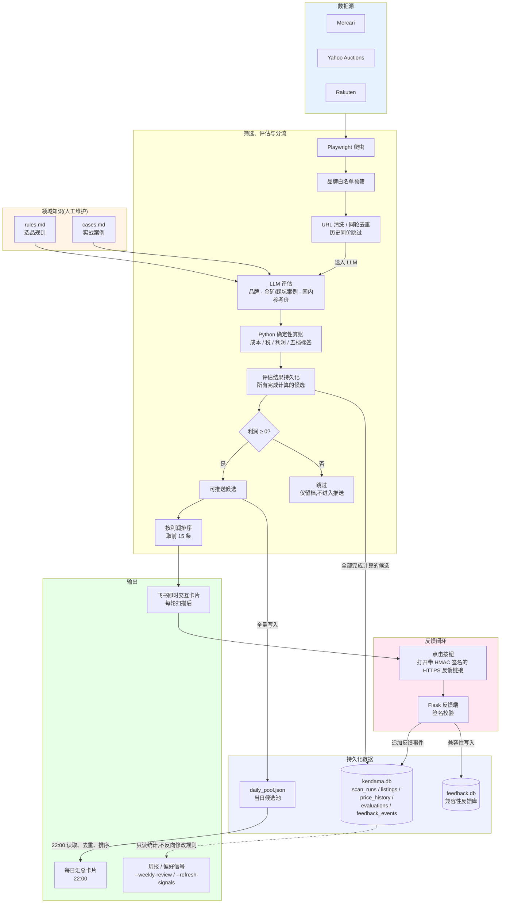

# kendama-selector

剑玉跨境选品助手

我做跨境剑玉采销,每天要在煤炉上翻几百条商品。
这个工具把我的选品判断写成规则,让 AI 替我做初筛,
通过**飞书自定义机器人**推送到手机,点击卡片按钮即可记录决策,
形成"AI 推荐 → 我反馈 → 规则迭代"的闭环。

> **项目状态**:个人使用中,持续优化(V1)。
> **定位说明**:这是一个**工具化的选品工作流**,不是能自主决策或自动下单的 Agent——
> 所有候选商品只会推送到飞书,买不买永远由我人工判断;规则、案例库、利润阈值
> 也都是人工维护的文件和确定性代码,系统不会自我修改判断标准。

---

## 为什么做这个

跨境采销的核心,是利用信息差和判断力。

剑玉这个品类小众但稳定。日本玩家圈子大,新品和老款流通活跃,
玩家对品相要求高——有轻微使用痕迹的剑玉,会以远低于全新的价格出售。
而国内的新玩家在找品质二手货,中间的差价里有利润。

但问题是:

- 每天有上百件新商品上架,大部分是基础款或残次品
- 真正值得拍的可能只有 3-5 件,有时甚至没有
- 我做了两年,知道哪些品牌的哪些款式值得买
- 但每天花在"翻商品"上的时间,占了 80%
- 为了第一时间拍下有价值的商品,还得频繁刷新

我想把浏览和初筛这件事让 AI 做。
但前提是:AI 必须懂我的判断标准——
什么样的产品有价值,什么样的痕迹会让价格腰斩,什么样的款式是坑。

这些知识在我脑子里,不在 AI 训练数据里。

所以这个项目的核心,不是用 AI——
**是把我的判断标准和选品经验,结构化成 AI 能读懂的规则,再用确定性代码把关键计算钉死**。

---

## 真实效果

### 卡片样式

<div align="center">
  
</div>

每条推送是一张飞书交互卡片,完整展示:
煤炉日元价 + 换算的价格 + 国内参考价 + 成本拆解
+ 利润 + 判定标签 + 一句话理由。
底部三个按钮记录我的反馈,点击后跳转到反馈端。

信息密度足以让我立马就能做初步判断,
节省的就是过去花在翻页 + 心算上的时间。

### 系统命中速度

<div align="center">
  
</div>

左图为 23:50 系统推送的某商品,右图为约 2 小时后的煤炉页面状态,
商品已被买家拍下(标记 SOLD)。

剑玉中古市场的好货流通速度往往以小时计,
人工浏览很难全天盯盘。

不过单一案例不能证明系统普遍有效。
反馈按钮和 SQLite 历史留存都已经接通,每周的复盘报告
(`--weekly-review`)会持续积累推送和实际决策的对应关系。

---

## 系统架构



### 核心流程

1. **抓取**:Playwright 模拟浏览器访问 Mercari / Yahoo 拍卖 / Rakuten 三个平台,按关键词提取商品标题、价格、链接、图片。
2. **品牌白名单**:按 `config.yaml` 里的品牌关键词做大小写无关的子串匹配,过滤掉不相关商品。
3. **URL 清洗与去重**:剔除无效链接;同一轮内同一 URL 只保留第一条(价格冲突只计数、不静默覆盖);同一商品若与历史记录的价格完全相同则跳过,不重复送 LLM。
4. **LLM 评估**:按 15 条一批送 DeepSeek(主)/硅基流动(备),带上 `rules.md` 和 `cases.md` 作为上下文。LLM **只输出三件事**:品牌识别、是否命中金矿/踩坑案例、国内参考行情价——不计算利润、成本、税。
5. **Python 确定性算账**:用确定性公式换算汇率、算总成本(运费手续费 + 满一定基础价比例后的关税),再按利润把商品分进五档:**跳过 / 盲盒 / 观望 / 推荐 / 强推**。具体阈值以 `ai_filter.py` 的 `assign_tag()` 和 `rules.md` 第七条为准,LLM 判断的"是否金矿"不再影响最终标签。
6. **评估结果持久化**:不论最终是否被淘汰,只要完成利润计算就写入 `kendama.db` 的 `evaluations` 表;同时维护 `listings`/`price_history` 记录商品身份与价格轨迹,用于识别降价信号。**这一步在判断利润正负之前发生**,负利润的"跳过"商品也会留档,只是不会进入后面任何推送环节。
7. **利润分流(只有这一次判断)**:完成落库之后,才判断利润是否 ≥ 0。利润 < 0 的商品到此为止,标记"跳过",不再出现在 `daily_pool.json` 或飞书里。利润 ≥ 0 的商品形成唯一一份**"可推送候选"**集合,后面两个输出都从这份集合派生,不是两个独立分支。
8. **两个输出,同一份候选集合**:
   - **全量**写入 `daily_pool.json`,供当天 22:00 的汇总使用;
   - 按利润降序**取前 15 条**,推送本轮飞书即时交互卡片,带 HMAC 签名的反馈按钮。
9. **反馈闭环**:点击按钮 → `feedback_server.py` 校验签名(缺签名或签名不匹配一律拒绝,返回 403)→ 同时写入两个库:兼容旧链路的 `feedback.db`,以及作为主历史库的 `kendama.db.feedback_events`。
10. **每日汇总**:每天 22:00(可配置)从 `daily_pool.json` 读取当天累计的全部候选,去重排序后推送一张汇总卡片;**推送成功才清空候选池**,失败则保留、等待下一次重试。这是一份独立于"即时 Top 15"的汇总,不会互相覆盖。
11. **周报与偏好信号**:`--weekly-review`/`--refresh-signals` 只读 `kendama.db`,生成可读的统计报告,不反向修改规则文件、prompt 或数据库。

### 为什么换掉 PushPlus

v1 用 PushPlus + 微信,卡片里的"按钮"其实是超链接,
微信内置浏览器不会自动打开外部域名,只能复制链接——反馈链路走不通。

换成飞书自定义机器人之后,卡片的 button 是原生组件,
点击按钮会打开带签名的 HTTPS 反馈链接,由反馈端完成校验和写入,无需用户做任何额外操作。

**注意**:飞书对卡片 button 的 `url` 字段有 HTTPS 要求。如果 `FEEDBACK_URL`
配的是 `http://`,飞书会静默丢弃整条按钮元素(卡片能收到,但看不到任何按钮),
不会报错也不会提示。具体见下方"反馈端暴露到公网"。

### 设计决策

- **LLM 只判断,Python 算账**(关键设计):
  早期把利润公式写进 prompt 让 LLM 算,但实际跑下来 LLM 会"凭印象估个数"——
  6000 日元的商品它能输出 ¥130 利润(实际 ¥24.9),9200 日元的商品它说 ¥114
  利润(实际亏损 ¥138)。大模型做多步骤算术本来就不可靠。
  现在利润、税、成本全部由 Python 用确定性公式计算,
  LLM 只负责给出"国内参考行情价"这个判断,数字从此不会再编。
- **用 Playwright 而不是 requests**:三个平台都有反爬,
  Playwright 模拟真实浏览器更稳定。
- **先本地预筛再送 LLM**:泛词搜索一次可能返回几百条商品,大部分品牌不在范围内。
  本地白名单匹配 + URL/历史价格去重,能显著减少实际送 LLM 的条数,降低调用成本。
- **主备 API**:国内访问 API 偶有抖动,主用 DeepSeek 官方,
  备用硅基流动作为兜底,不阻塞业务。
- **temperature=0**:LLM 默认有随机性,同一商品两次评估可能给出不同结论。
  设为 0 后输出稳定,便于后续做效果回归。
- **每日汇总不过 LLM**:汇总只是"去重 + 排序 + 套模板",
  这三件事 Python 一行就能搞定,过 LLM 反而不稳定还多花钱。
- **反馈接收端用 Flask + SQLite,并要求 HMAC 签名**:个人级写入量,没必要上 PostgreSQL;
  但公网暴露的写入端点必须校验签名,否则任何人都能拼 URL 往数据库里灌脏数据。
- **SQLite 留存全部历史(`kendama.db`)**:`daily_pool.json` 只是"当天候选池",
  每天汇总后会清空;真正的长期历史(扫描记录、商品、价格轨迹、评估结果、反馈事件)
  都落在 `kendama.db` 里,供周报和偏好信号使用。

---

## 快速开始

### 环境要求

- Python 3.10+
- 操作系统:macOS / Linux / Windows

### 申请所需的服务

| 服务 | 用途 | 申请地址 |
|------|------|---------|
| DeepSeek | 主用 LLM | https://platform.deepseek.com |
| 硅基流动 | 备用 LLM | https://siliconflow.cn |
| 飞书 | 接收推送的群聊 + 自定义机器人 | https://www.feishu.cn |
| 云服务器(可选) | 7x24 小时无人值守运行 | 任意云厂商均可,见下方"部署到云服务器" |

### 安装

```bash
# 克隆仓库
git clone https://github.com/yourname/kendama-selector.git
cd kendama-selector

# 安装依赖
pip install -r requirements.txt

# 安装 Playwright 浏览器
playwright install chromium

# 配置环境变量(注意源文件名是 env.example,没有前导点)
cp env.example .env
# 编辑 .env,填入 DeepSeek API Key、飞书 webhook、反馈签名密钥等
```

### 创建飞书机器人

1. 在飞书里新建一个群聊(只有自己也行)
2. 群设置 → 群机器人 → 添加机器人 → 自定义机器人
3. 复制 webhook 地址,填入 `.env` 的 `FEISHU_WEBHOOK`

### 配置反馈签名密钥

`FEEDBACK_SIGNING_SECRET` 用于给反馈按钮链接做 HMAC-SHA256 签名,
`main.py`(生成链接)和 `feedback_server.py`(校验签名)两边必须使用同一个值。

```bash
python -c "import secrets; print(secrets.token_hex(32))"
```

把结果填进 `.env` 的 `FEEDBACK_SIGNING_SECRET`。**不配置这个值(或留占位符文本)
时,卡片会优雅降级为不带任何反馈按钮,不会报错,但也无法记录反馈。**

### 运行

```bash
# 启动主程序:立即执行一次扫描,然后进入定时循环
python main.py

# 启动反馈接收端(可选,但点按钮记录反馈要靠它)
python feedback_server.py
```

主程序默认进入**持续运行模式**:启动即扫描一次,之后按 `config.yaml` 里配置的
分钟数(默认 60)循环扫描,每天固定时间(默认 22:00)推送一次全天汇总,
直到手动终止(Ctrl+C)。

#### 命令一览

```bash
# 持续运行模式(默认):启动即扫描一次,之后进入定时循环
python main.py

# 单轮模式:完整扫描一轮(真实抓取 + 真实 LLM + 真实飞书推送)后直接退出
python main.py --once

# 单轮模式 + 范围收窄:只扫指定平台/关键词,覆盖每平台每关键词的抓取上限
# --platform/--keyword 可重复传入;--platform/--keyword/--max-items 只能配合 --once 使用
python main.py --once --platform Mercari --keyword Kendama --max-items 30

# 反馈历史导入:把 feedback.db 里既有的历史反馈幂等导入 kendama.db.feedback_events(不产生重复事件)
python main.py --migrate-feedback

# 每周复盘:生成 reports/weekly_review_YYYYMMDD.md,默认统计最近 7 天
python main.py --weekly-review
python main.py --weekly-review --days 14

# 偏好信号:从 kendama.db 生成 personalized_signals.md(仅供人工审核)
python main.py --refresh-signals

# 只读状态摘要:不扫描、不调用 LLM、不推送飞书、不创建数据库
python main.py --status

# 启动前配置检查:不扫描、不调用 LLM、不推送飞书
python main.py --check-config
```

`--migrate-feedback`/`--weekly-review`/`--refresh-signals`/`--status`/`--check-config` 五个维护命令互斥
(一次只能用一个),且都不能与 `--once`/`--platform`/`--keyword`/`--max-items` 同时使用。

> 每个命令的完整副作用边界(是否抓取/调用 LLM/推送飞书/写数据库)、
> 五档标签的判定阈值、故障排查方式,见根目录 [`SKILL.md`](SKILL.md)。

### 反馈端暴露到公网

`feedback_server.py` 默认监听本地 5001 端口(可用 `FEEDBACK_PORT` 覆盖),
飞书按钮点击需要它能从公网访问,并且**必须是 HTTPS**——
飞书会静默丢弃 `http://` 的按钮 URL(卡片能收到,按钮却看不见,且不报错)。

常见做法(任选其一):

1. **域名 + 反向代理 + 证书**:如果服务器已有域名,用 Nginx 或 Caddy 做反向代理,
   把 `/feedback` 转发到本地 5001 端口,证书用 Let's Encrypt(免费、自动续期)。
   配置好后把 `https://你的域名/feedback` 填进 `.env` 的 `FEEDBACK_URL`。
2. **临时隧道工具**:本地开发或还没有域名时,可以用任意提供 HTTPS 公网地址的
   内网穿透工具,把本地 5001 端口映射出去,拿到的 `https://` 地址填进 `FEEDBACK_URL`。

启动时 `main.py` 会打印一行诊断日志,提示 `FEEDBACK_URL`/`FEEDBACK_SIGNING_SECRET`
是否已正确配置(而非占位符文本),方便排查"按钮看不见"的问题。

### 适配其他品类

`rules.md` 和 `cases.md` 是这个项目的核心。
换品类时只需重写这两个文件:

- `rules.md`:你的判断规则(品牌、价格区间、款式偏好等)
- `cases.md`:你的实战案例(过去赚到的、踩过的坑)

代码层面不需要改动,LLM 会读这两个文件作为上下文;
成本/利润公式和标签阈值是代码里的确定性规则,如果新品类的成本结构不同,
需要同步调整 `ai_filter.py` 的 `calculate_cost()`/`assign_tag()`。

### 部署到云服务器(通用流程)

本项目不依赖任何特定云厂商,以下流程适用于任意能跑 systemd 的 Linux 服务器:

```bash
# 1. 本地开发完成后提交并推送
git add <改动的文件>
git commit -m "..."
git push

# 2. 服务器上拉取代码
ssh user@your-server
cd /path/to/kendama-selector
git pull

# 3. 安装依赖(首次部署,或依赖变更后执行)
pip install -r requirements.txt
playwright install chromium
playwright install-deps   # Linux 通常需要额外的系统依赖
cp env.example .env       # 首次部署需要;编辑 .env 填入真实密钥,不要提交到 Git
```

用 `systemd` 托管扫描服务和反馈服务,比 `nohup` 更适合长期无人值守运行——
进程崩溃会自动重启,开机自启,日志用 `journalctl` 统一查看。示例 unit 文件
(路径、用户名按你的服务器实际情况替换,不要照抄):

```ini
# /etc/systemd/system/kendama-scan.service
[Unit]
Description=kendama-selector scanning service
After=network.target

[Service]
WorkingDirectory=/path/to/kendama-selector
ExecStart=/path/to/kendama-selector/.venv/bin/python main.py
Restart=on-failure
User=youruser

[Install]
WantedBy=multi-user.target
```

```ini
# /etc/systemd/system/kendama-feedback.service
[Unit]
Description=kendama-selector feedback server
After=network.target

[Service]
WorkingDirectory=/path/to/kendama-selector
ExecStart=/path/to/kendama-selector/.venv/bin/python feedback_server.py
Restart=on-failure
User=youruser

[Install]
WantedBy=multi-user.target
```

```bash
sudo systemctl daemon-reload
sudo systemctl enable --now kendama-scan kendama-feedback

# 查看日志
journalctl -u kendama-scan -f
journalctl -u kendama-feedback -f

# 部署更新后重启
sudo systemctl restart kendama-scan kendama-feedback
```

我个人长期在腾讯云轻量应用服务器(2 核 2G,Ubuntu)上跑这套流程,
但流程本身与云厂商无关。

---

## 运行成本

以我个人的实际使用为例(每小时扫描一次,三平台):

| 项目 | 月成本(人民币) | 说明 |
|------|--------------|------|
| 云服务器 | 视配置和厂商而定 | 2 核 2G 级别的入门配置即可 |
| DeepSeek API | 约 5-15 元 | 每小时一次,日均约 24 次调用 |
| 飞书自定义机器人 | 0 元 | 个人和小团队免费 |
| 域名 / SSL(可选) | 约 1-5 元 | 域名几块钱一年,Let's Encrypt 证书免费 |

如果用 GPT-4 / Claude 替代 DeepSeek,API 成本上升 5-10 倍,
对剑玉这种客单价不高的品类不划算。
选 DeepSeek 的核心理由——**便宜且够用,比最强重要**。

---

## 项目结构

```
kendama-selector/
├── main.py                  主入口:CLI 解析、调度、飞书推送、反馈签名
├── scraper.py                三平台爬虫(Mercari / Yahoo / Rakuten)
├── ai_filter.py               LLM 评估 + Python 算利润/打标签 + 每日汇总
├── db.py                      kendama.db 的表结构与读写(scan_runs/listings/
│                              price_history/evaluations/feedback_events)
├── reporting.py                只读周报(--weekly-review)与偏好信号(--refresh-signals)
├── scraper_health.py           抓取健康检查(连续多轮 0 条时告警)
├── feedback_server.py          反馈接收端(Flask + SQLite,签名校验)
├── test_offline_fixes.py       离线单元测试,不联网、不调用真实 LLM/飞书
├── config.yaml                关键词、品牌白名单、扫描间隔
├── requirements.txt            依赖
├── env.example                 环境变量模板
├── rules.example.md            选品规则(脱敏示例)
├── cases.example.md            实战案例(脱敏示例)
├── SKILL.md                    运行契约:命令、数据文件、故障排查、验收范围
└── .gitignore
```

`rules.md`、`cases.md` 是真实业务规则和案例,已在 `.gitignore` 中,不会被提交;
仓库里能看到的 `rules.example.md`/`cases.example.md` 是脱敏示例。

---

## 数据与文件说明

以下文件在运行过程中产生,均已在 `.gitignore` 中,不应提交到 Git:

| 文件/目录 | 内容 |
|---|---|
| `.env` | 真实密钥(DeepSeek/硅基流动/飞书 webhook/反馈签名密钥) |
| `rules.md` / `cases.md` | 真实选品规则和历史案例 |
| `daily_pool.json` | 当日候选池,每天汇总推送成功后清空 |
| `feedback.db` | 兼容性反馈库:`feedback_server.py` 为兼容旧反馈链路仍会写入,同时向 `kendama.db.feedback_events` 追加同一条历史事件;`--migrate-feedback` 用于把既有历史反馈幂等导入主库 |
| `kendama.db` | 完整历史:`scan_runs`/`listings`/`price_history`/`evaluations`/`feedback_events` |
| `scraper_health.json` | 抓取健康检查的连续 0 计数状态 |
| `reports/` | `--weekly-review` 生成的周报目录 |
| `personalized_signals.md` | `--refresh-signals` 生成的偏好信号,仅供人工审核 |

完整的字段含义、生命周期和故障排查方式见 [`SKILL.md`](SKILL.md)。

---

## 数据闭环与持续优化

这个系统不是"一次性写完就用"——
**它的价值随着真实反馈的积累而增长**。

### 反馈闭环怎么运作

早期我每天手动在备忘录里标记是否同意 AI 的判断,反馈摩擦太大,基本坚持不下来。
现在的闭环:

- 卡片里直接点击反馈按钮
- 请求带 HMAC 签名,`feedback_server.py` 校验后写入 SQLite(签名缺失或不匹配一律拒绝)
- 同时追加一条历史事件到 `kendama.db.feedback_events`,不覆盖历史
- `--weekly-review` 可以看到反馈复盘统计,`--refresh-signals` 能看到按品牌/来源/价格区间
  聚合出的正负向倾向(仅供人工审核,不会自动回写规则或注入 prompt)

### 已落地的迭代

- 反馈按钮 + HMAC 签名校验,公网端点不接受未签名请求
- 利润计算从 LLM 移到 Python 确定性公式,标签判定不再依赖 LLM 的"金矿"判断
- SQLite(`kendama.db`)留存完整历史,不再只依赖会被清空的 `daily_pool.json`
- 每周复盘报告(`--weekly-review`)和偏好信号(`--refresh-signals`)
- 抓取健康检查:某平台连续多轮抓到 0 条会触发一次飞书告警
- 降价识别:基于历史价格判断降价幅度,在卡片里标注 `【降价 ¥N / P%】`

### 下一步计划

- **关注卖家监控**:优质卖家会持续上架同风格商品,盯人比盯关键词命中率更高。
  计划在 `config.yaml` 加 `watched_sellers` 列表,复用现有关键词路径。
- **偏好信号的进一步利用**:当前 `personalized_signals.md` 只做可解释的计数/占比统计,
  仅供人工审核。样本积累到一定量级后,再考虑 embedding 相似度匹配作为 LLM 评分的
  辅助信号,需要警惕"回声室"——系统越推我买过的款,我就越看不到新机会。
- **平台原生 item_id 解析**:目前商品身份用 URL 本身做唯一键,`legacy_url_hash`
  只是为了兼容旧 `feedback.db` 而保留的冗余字段,尚未做三平台 item_id 的规范化解析。

---

## FAQ

**Q: 为什么不直接 fine-tune 一个模型?**

A: Fine-tune 需要大量标注数据和算力,对个人项目不划算。
更重要的是,我的领域知识本来就在持续变化(每周都有新案例),
fine-tune 之后再修改的成本很高。
用 prompt + 规则书的方式,我可以随时改 `rules.md` 立即生效,
迭代速度远高于 fine-tune。

**Q: 为什么利润不让 LLM 算,要 Python 重新算一遍?**

A: 实测下来 LLM 算账不靠谱。
即使把公式写得再清楚,DeepSeek 也常常给出"看起来合理但其实是编的"数字——
6000 日元的商品 LLM 算出来 ¥130 利润,Python 用确定性公式算实际只有 ¥24.9;
9200 日元的 LLM 给 ¥114,实际亏损 ¥138。
大模型做多步骤算术本来就不可靠,这不是 prompt 能解决的问题。
正确的分工是:LLM 做判断(品牌、稀缺度、参考价),Python 做算术、判定标签。
两者各做擅长的事,系统才稳。

**Q: 反馈数据怎么转化成更好的推荐?**

A: 当前已经落地的是最浅的一层——`--refresh-signals` 从 `kendama.db` 的反馈历史
统计出按品牌/来源/价格区间的正负向倾向,写成 `personalized_signals.md`
仅供人工审核,不会自动注入 LLM prompt。更深的路径(embedding 相似度匹配、
轻量分类器二次过滤)留待样本积累到足够量级后再评估,同时要警惕"回声室"效应,
保留一定比例的探索性推送。

**Q: 为什么不用 LangChain / Dify / Coze 这类框架?**

A: 我这个项目的核心逻辑很简单——
爬虫 → 预筛 → LLM 评估 → Python 算账/打标签 → 推送 → 反馈。
用框架反而会引入不必要的复杂度。
直接写 Python + OpenAI SDK,调试和修改都很直接。

**Q: 为什么从 PushPlus 换成飞书?**

A: PushPlus 推到微信的"按钮"本质是超链接,
微信内置浏览器对外部域名做了拦截,点击只能复制链接,反馈链路走不通。
飞书自定义机器人的 button 是原生交互组件,点击会打开带签名的 HTTPS 反馈链接,再由反馈端完成校验和写入,
对个人项目是性价比最高的方案。

**Q: 为什么不用 GPT-4 而用 DeepSeek?**

A: 对剑玉这种客单价不高的品类,API 成本必须算清楚。
DeepSeek 的能力对"按规则筛选商品 + 给参考价"这个任务完全够用,
但价格只有 GPT-4 的 1/10 左右。
选模型也是 ROI 问题——**够用且经济**比"最强"重要。

**Q: 适配其他品类需要改什么?**

A: 主要是重写 `rules.md` 和 `cases.md` 两个文件;
如果新品类的成本结构(汇率、关税规则、运费)不同,还需要同步调整
`ai_filter.py` 的 `calculate_cost()`。代码框架本身不需要大改。

**Q: 一轮扫描全流程要多久?**

A: 从启动扫描到推送到手机,通常在一两分钟量级。
爬虫需要串行访问三个平台,LLM 评估按批次调用。
对"每小时一次"的默认扫描频率来说完全够用。

---

## 局限与诚实说明

- **不适合大规模商用**:本项目为个人采购场景设计,
  商业化需要更严谨的反爬策略、并发能力和监控告警。
- **领域规则需要重写**:`rules.md` 是我的剑玉经验,
  换品类必须重写,代码框架可复用。
- **LLM 评估不是完全可靠**:即使有规则书,LLM 偶尔会产生幻觉或绕过规则,
  最终决策仍需人工把关——这正是反馈按钮存在的意义。
- **抓取依赖页面结构**:三个平台的解析用固定 CSS selector,
  平台改版可能导致某个平台抓取中断,需要人工更新 `scraper.py` 里的 selector
  (抓取健康检查会在连续多轮 0 条时告警,帮助尽早发现)。
- **反馈不是模型准确率的严格验证**:反馈只反映我个人的买入/放弃决策,
  样本量和视角都有限,不能当成对 LLM 判断正确性的完整、无偏评估。

---

## 技术栈

- **语言**:Python 3.10+
- **爬虫**:Playwright(无头浏览器)
- **LLM**:DeepSeek(主) / DeepSeek via SiliconFlow(备)
- **调度**:schedule
- **推送**:飞书自定义机器人(交互式卡片)
- **反馈接收**:Flask + SQLite,HMAC-SHA256 签名校验
- **持久化历史**:SQLite(`kendama.db`)+ 只读统计报告(`reporting.py`)
- **图片代理**:wsrv.nl(对老链接更稳)
- **部署**:任意 Linux 服务器 + systemd(见"部署到云服务器")

---

## 致谢

- [Playwright](https://playwright.dev/) —— 无头浏览器抓取
- [DeepSeek](https://www.deepseek.com/) —— LLM 推理
- [飞书开放平台](https://open.feishu.cn/) —— 交互式卡片消息
- [Flask](https://flask.palletsprojects.com/) —— 反馈接收端
- [wsrv.nl](https://wsrv.nl/) —— 图片代理服务

---

## License

[MIT](LICENSE)

仓库内的 `rules.example.md` 和 `cases.example.md` 是脱敏示例,
不包含完整的商业判断逻辑。
代码框架自由使用,使用导致的任何损失由使用者自行承担。

---

## 开发说明

我没有计算机或软件工程背景。
本项目的代码部分,主要在 AI 协作下完成。

我负责:领域规则(rules.md / cases.md)、需求设计、决策判断、工程整合。
代码实现:Claude、Gemini 和 DeepSeek 提供了大量帮助。

我相信这种"领域专家 + AI 协作"的工作方式会变得越来越普遍。
