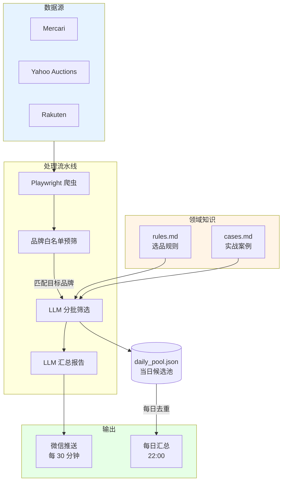

# kendama-selector

剑玉跨境选品助手

我做跨境剑玉采销,每天要在煤炉上翻几百条商品。
这个工具把我的选品判断写成规则,让 AI 替我做初筛。

> **项目状态**:个人使用中,持续优化。代码可参考,部分领域规则因涉及商业经验已脱敏。

---

## 为什么做这个

跨境采销的核心,是利用信息差和判断力。

剑玉这个品类小众但稳定——日本的玩家圈子在退坑、清仓,
国内的新玩家在找品质二手货。中间的差价里有钱赚。

但问题是:

- 每天有上百件新商品上架,大部分是基础款或残次品
- 真正值得拍的可能只有 3-5 件
- 我做了三年,知道哪些品牌的哪些款式值得买
- 但每天花在"翻商品"上的时间,占了 80%

我想把"翻商品"这件事让 AI 做。
但前提是:AI 必须懂我的判断标准——
什么是 Sulab 的灵魂卖点,什么样的痕迹会让梦园无双腰斩,
Krom 的基础款为什么国内卖不动。

这些知识在我脑子里,不在 AI 训练数据里。

所以这个项目的核心,不是用 AI——
**是把我脑子里的判断标准,结构化成 AI 能读懂的规则**。

---

## 系统架构



### 核心流程

1. **抓取**:Playwright 模拟浏览器访问三个平台,提取商品标题、价格、链接、图片
2. **本地预筛**:基于品牌白名单做字符串匹配,过滤大部分无关商品。
   这一步省下了大量的 LLM token 消耗
3. **LLM 分批筛选**:按 15 条一批送给 DeepSeek,带上 `rules.md` 和 `cases.md` 作为上下文
4. **LLM 汇总**:把所有批次的候选合并,生成手机端友好的精简报告
5. **推送**:通过 PushPlus 推送到微信,每 30 分钟一次
6. **每日汇总**:22:00 触发,把当天所有候选去重后生成全天报告

### 设计决策

- **为什么用 Playwright 而不是 requests**:三个平台都有反爬,Playwright 模拟真实浏览器更稳定
- **为什么先本地预筛再送 LLM**:泛词搜索一次返回 100+ 商品,大部分是无关品牌。
  本地预筛后只剩 15-20 条,LLM 调用成本显著降低
- **为什么主备 API**:国内访问 API 偶有抖动,主用 DeepSeek 官方,
  备用硅基流动作为兜底,任一可用就不阻塞业务
- **为什么 temperature=0**:LLM 默认有随机性,同一商品两次评估可能给出不同结论。
  设为 0 后输出稳定,便于后续做 A/B 测试和效果回归

---

## 快速开始

### 环境要求

- Python 3.10+
- 操作系统:macOS / Linux / Windows

### 申请所需的 API Key

| 服务 | 用途 | 申请地址 |
|------|------|---------|
| DeepSeek | 主用 LLM | https://platform.deepseek.com |
| 硅基流动 | 备用 LLM | https://siliconflow.cn |
| PushPlus | 微信推送 | https://www.pushplus.plus |

### 安装

```bash
# 克隆仓库
git clone https://github.com/yourname/kendama-selector.git
cd kendama-selector

# 安装依赖
pip install -r requirements.txt

# 安装 Playwright 浏览器
playwright install chromium

# 配置环境变量
cp .env.example .env
# 然后编辑 .env,填入你的 API Key
```

### 运行

```bash
python main.py
```

启动后会立即执行一次扫描,然后进入定时模式:
- 每 30 分钟扫描一次
- 每天 22:00 输出全天汇总

### 配置自己的领域规则

`rules.md` 和 `cases.md` 是这个项目的核心。
如果你想用这个框架做其他品类(不只是剑玉),
请按以下结构改写这两个文件:

- `rules.md`:写你的判断规则(品牌、价格区间、款式偏好等)
- `cases.md`:写你的实战案例(过去赚到的、踩过的坑)

代码层面不需要改动,LLM 会读这两个文件作为上下文。

---

## 项目结构

```
kendama-selector/
├── main.py              主入口,定时调度
├── scraper.py           三平台爬虫
├── ai_filter.py         LLM 评估与汇总
├── rules.md             选品规则(脱敏版)
├── cases.md             实战案例(脱敏版)
├── requirements.txt     依赖
├── .env.example         环境变量模板
└── .gitignore
```

---

## 数据闭环与持续优化

这个系统不是"一次性写完就用"——
**它的价值随着真实数据的积累而增长**。

### 当前的做法

每天我会:
1. 看 AI 推送的候选商品,标记是否同意它的判断
2. 实际拍下后,记录最终的国内成交价
3. 把每次"AI 推荐对了"和"AI 推荐错了"的案例,提炼成一句话规则
4. 周末更新 `rules.md` 和 `cases.md`

这是一个**"用真实反馈持续优化 Prompt 上下文"**的过程,
不是模型微调——核心模型(DeepSeek)不变,
变的是喂给模型的领域知识。

### 已落地的迭代

基于 21 笔历史成交数据,我从 `rules.md` v0 迭代到当前版本,
主要改进:

- 把"品牌优先级"细化到"品牌+漆面+款式"三层判断
- 增加"重量超标"的硬门槛(剑玉玩家对重量极其敏感)
- 提炼 4 个金矿案例 + 3 个踩坑案例进 `cases.md`

### 下一步计划

- [ ] 把决策反馈从手动记录改为半自动(推送时附带反馈按钮)
- [ ] 加入历史成交数据库,让 LLM 在评估时参考类似商品的真实成交价
- [ ] 实现简单的复盘面板(每周自动统计准确率)

---

## 局限与诚实声明

- **不适合大规模商用**:本项目是为我个人的采购场景设计的。
  如果想做商业化,需要更严谨的反爬、数据库、监控
- **领域规则需要重写**:`rules.md` 是我的剑玉经验,
  换品类必须完全重写,代码框架可复用
- **LLM 评估不是完全可靠**:即使有规则书,LLM 偶尔会产生幻觉或绕过规则,
  最终决策仍需要人工把关
- **代码不是工业级**:没有单元测试,没有完整的错误监控,
  作为个人工具够用,作为生产系统还不够

---

## 技术栈

- **语言**:Python 3.10+
- **爬虫**:Playwright (无头浏览器)
- **LLM**:DeepSeek-V3 (主) / DeepSeek-V3 via SiliconFlow (备)
- **调度**:schedule
- **推送**:PushPlus + 微信
- **图片代理**:wsrv.nl (绕过微信内置浏览器的图片防盗链)

---

## License


本项目采用 [MIT License](LICENSE) 开源协议。

你可以自由地克隆、修改、分发和用于商业目的。但请注意：本项目仅提供工具层面的自动化架构方案，**不构成任何投资或采销建议**。因使用本工具或参考其中的示例规则而产生的任何直接或间接的财务亏损，需由使用者自行承担。

##  Contributing

本项目本质上是一个高度个人化、重业务轻代码的效率工具。因为我平时的主要精力都在跨境采销和复盘上，可能无法像全职维护大型开源项目那样及时处理所有的 Issue 和 PR。

但是，如果你对以下几个方向有好的代码优化思路，非常欢迎提交 PR 或在 Issue 里交流探讨：

* **爬虫扩展**：支持更多的日本/海外中古二手平台（如 Suruga-ya、PayPay 杂货等）。
* **工程优化**：用更优雅、低延迟的方式处理图片防盗链，或提升数据持久化的效率。
* **品类横向迁移**：如果你成功把这套“预筛+LLM算账”的框架运用到了其他的套利品类（例如露营装备、中古相机、潮玩手办），请一定在 Issue 里分享你的实战经验！

##  Acknowledgments

* **[Playwright](https://playwright.dev/)**：提供了极其强大的无头浏览器抓取能力，有效对抗了多数基础反爬机制。
* **[DeepSeek](https://www.deepseek.com/)**：提供了极具性价比的大语言模型，是本项目实现“低成本商业推理”的核心大脑。
* **[PushPlus](https://www.pushplus.plus/)**：让个人开发者能以最低的成本实现稳定的微信端消息触达。

---

> **写在最后**：能够跨越信息差赚到钱的，从来不是 AI 模型本身，而是你对这个品类的热爱、经年累月的市场嗅觉，以及无数次真金白银踩出来的坑。AI 只是替我们 24 小时搬砖的双手，你的大脑和业务认知才是真正的核心壁垒。祝各位选品愉快，利润长虹！
